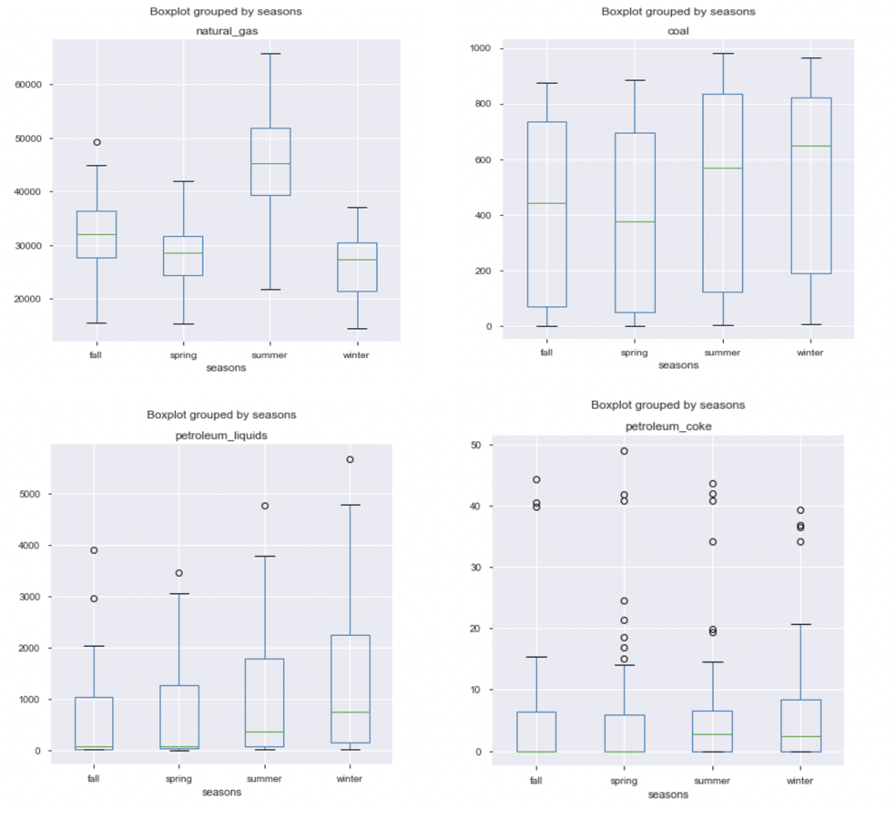
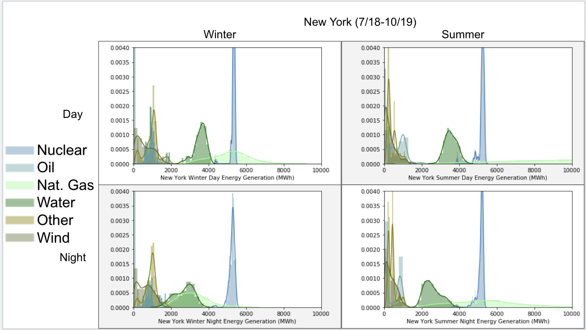
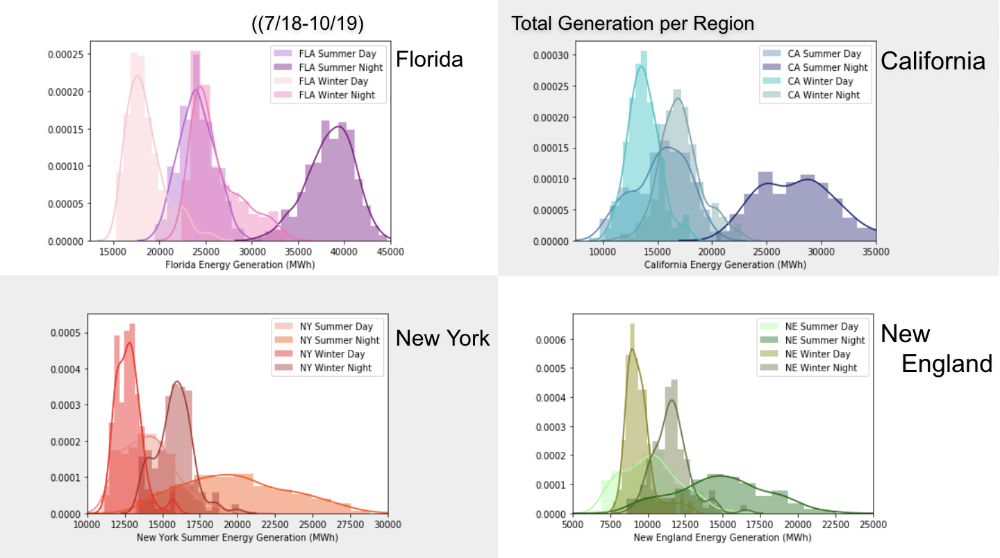
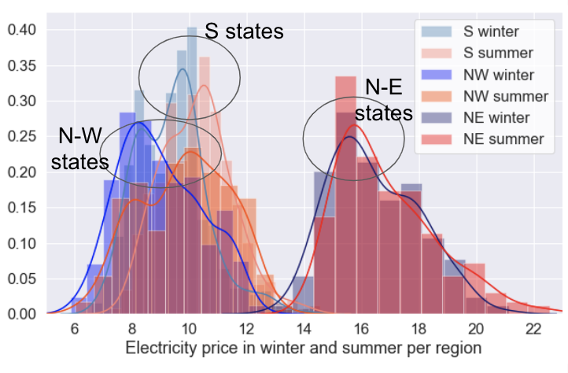
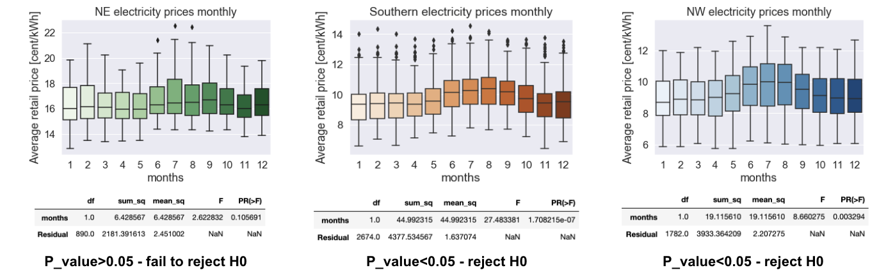

**Hypothesis Testing**

Analysis of the US Energy consumption, generation, and price (2001 – 2019) inspecting the statistical significance of seasonality.

-	Data received from the U.S. Energy Information Administration API.

Final slides:
https://docs.google.com/presentation/d/1psjsPQoepz7btcCh_vs4VHV5TJp_xXzh_wPcNyBuboo/edit#slide=id.p

Areas of Research:
1. Sources of Electricity  (fuel types)
2. Seasonality of:
    -Net Generation
    -Consumption
    -Price

**Question 1:** (Consumption)
What is the difference in New York's electricity consumption per season?

    H0: Mean fuel consumption of each season are equal
    H1: Mean fuel consumption of each season are not equal

  **Tests Used:**
  - ANOVA where we compare means across multiple groups (seasons).
  - Tukeys HSD which provided us with multiple comparisons of the mean.

  **IV:**  Seasons - Discrete
  **DV:** Fossil Fuels Consumption(thsnd tons) - Continuous

**Results for Energy Consumption**
Overall, we REJECT THE H0 because the means of fuel consumption are not equal.

Natural Gas
- P-value < Alpha = Reject the H0
- NY is consuming much more natural gase in the summer months vs other seasons
- Natural gas takes up majority of fossil fuel energy consumption (look at numbers in the Y axis)

Coal
- P-value > Alpha = Fail to Reject the H0
- Coal consumption is a bit higher in the winter but fairly similar compared to other months.

Petroleum Liquids
- P-value < Alpha = Reject the H0
- The average petroleum liquid consumption is a bit higher in the winter

Petroleum Coke
- P-value > Alpha = Fail to Reject the H0
- New York consumes much less petroleum coke then the other 3 Fossil Fuels

**Energy Generation - Hourly data**

**Energy Generation - By Region**

**Question 2** (Price)
Is there a difference in electricity price per season between northern and southern States?

    H0: mean price is equal per season between the states
    H1: means price is not equal per season between the states

  **Tests Used**
  - Two sample TTest
  - ANOVA

  **IV:** Seasons - Discrete
  **DV:** Average retail price per state in 2001-2019 - adjusted for inflation - Continuous

**Results:** REJECT H0 - electricity price is significantly different per season and between N and S

**Question 3** (Price)
Is there a monthly difference in electricity price in N and S states?

    H0: mean price is equal monthly in N and S states
    H1: means price is not equal monthly in N and S states

  **Tests Used:**
  - ANOVA
  - Tukey pairwise comparison

  **IV:**  Months - Discrete
  **DV:** Average retail price per state in 2001-2019 - adjusted for inflation - Continuous (Distribution not normalized)

**Results:** REJECT H0 - electricity price is significantly different monthly

